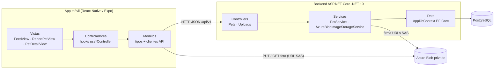
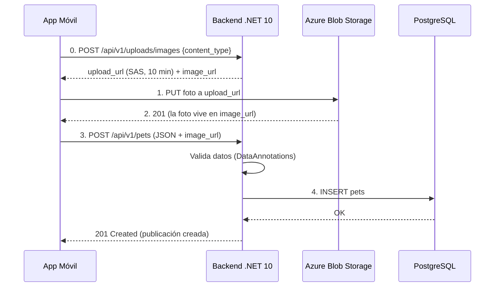

# Arquitectura — Regresa a Casa

Red social de mascotas perdidas (MVP). Basada en el documento de diseño
[mockups-backend-mascotas-perdidas.md](mockups-backend-mascotas-perdidas.md) y los datos de ejemplo de
[`mock/db.json`](../mock/db.json).

| Capa | Tecnología |
|---|---|
| App móvil | React Native + Expo (SDK 57) + TypeScript + Expo Router |
| Backend | ASP.NET Core **.NET 10** (Web API con controladores MVC) |
| Base de datos | PostgreSQL 17 + Entity Framework Core 10 (Npgsql) |
| Fotos | Azure Blob Storage (Azurite en local) · ver [azure-blob-storage.md](azure-blob-storage.md) |

Ambos lados siguen el patrón **Modelo – Vista – Controlador (MVC)**.

---

## 1. Vista general de componentes



## 2. Flujo de publicación (foto primero, luego JSON)

Igual al del documento de diseño; se agregó el paso 0 para que la app **no** tenga la llave de Azure.



---

## 3. MVC en el backend (`backend/src/RegresaACasa.Api`)

```
RegresaACasa.Api/
├── Controllers/          ← C: reciben HTTP, validan y delegan
│   ├── PetsController.cs        GET/POST /api/v1/pets
│   └── UploadsController.cs     POST /api/v1/uploads/images
├── Models/               ← M
│   ├── Entities/                Pet (tabla)
│   ├── Dtos/                    Request/Response = la "Vista" JSON
│   └── PetMappings.cs           Entidad → DTO
├── Services/             Lógica de negocio (interfaces + implementación)
├── Data/                 AppDbContext, migraciones, seeder
├── Configuration/        Opciones y ajustes de serialización
└── Program.cs            Composición (.env, DI, JSON snake_case, errores, BD)
```

- **Modelo**: la entidad EF `Pet` representa la BD; los DTOs representan el contrato.
- **Vista**: en una API la vista es la representación JSON. Los DTOs (`PetResponse`, `ErrorResponse`,
  `ImageUploadResponse`) + la política `snake_case` definen exactamente qué ve el cliente
  (p. ej. `created_at` existe en BD pero no se expone).
- **Controlador**: delgado; no toca EF directamente, llama a `IPetService`.
- **Servicios**: capa entre controlador y datos para que la lógica sea testeable. No se agregó un
  patrón Repository porque `DbContext` ya cumple ese rol (Unit of Work + Repository).

Convenciones transversales (en `Program.cs`):
- JSON en `snake_case` (`JsonNamingPolicy.SnakeCaseLower`).
- Errores de validación → `400 { "success": false, "message": "El campo 'zone' es requerido" }`.
- Excepciones no controladas → `500 { "success": false, "message": "Ocurrió un error inesperado" }`.
- Sin `ConnectionStrings:Default` la API usa una BD **en memoria** (arranque sin instalar nada);
  con ella usa PostgreSQL y aplica migraciones al iniciar.

## 4. MVC en la app móvil (`mobile/src`)

```
src/
├── app/                  Rutas de Expo Router (solo conectan ruta → Vista)
│   ├── _layout.tsx              Stack + PetsProvider
│   ├── index.tsx                Muro
│   ├── report.tsx               Cuestionario (modal)
│   └── pets/[id].tsx            Detalle + botón para llamar
├── models/               ← M: tipos del contrato, validaciones y clientes HTTP
│   ├── pet.ts
│   └── api/  httpClient.ts · petApi.ts · imageUploadApi.ts
├── controllers/          ← C: hooks con estado y acciones
│   ├── PetsContext.tsx          estado compartido del muro
│   ├── useFeedController.ts
│   ├── useReportPetController.ts
│   └── usePetDetailController.ts
├── views/                ← V: componentes visuales sin lógica de red
│   ├── FeedView.tsx · ReportPetView.tsx · PetDetailView.tsx
│   ├── components/  PetCard · FormField · PrimaryButton
│   └── theme.ts
└── config/env.ts         EXPO_PUBLIC_API_URL, EXPO_PUBLIC_SKIP_IMAGE_UPLOAD
```

Regla: **Vista → Controlador → Modelo**. Una vista solo llama a su hook controlador; el controlador usa
los modelos/API y actualiza el estado; ninguna vista hace `fetch`.

Pantallas: **Muro**, **Cuestionario** y **Detalle** de la publicación (con botón para llamar al dueño).

---

## 5. Decisiones y cambios respecto al documento de diseño

| Tema | Documento original | Implementación | Motivo |
|---|---|---|---|
| Backend | Node.js / Express | ASP.NET Core .NET 10 | Requisito del proyecto |
| Base de datos | PostgreSQL o MongoDB | PostgreSQL + EF Core | Modelo relacional simple (1 → N), migraciones |
| Subida de foto | App → Azure directo | Igual, con URL SAS firmada por la API (`POST /api/v1/uploads/images`) | La app no debe contener la llave de la cuenta de Azure |
| Lectura de fotos | URL pública | Contenedor **privado**; el muro devuelve `image_url` con SAS de lectura (60 min) | Evita abuso del Storage; ver [azure-blob-storage.md](azure-blob-storage.md) |
| Comentarios | `POST /pets/:id/comments` y `comments` en cada publicación | **Eliminados** | Fuera del alcance del MVP; el contacto es por el teléfono de la publicación |
| Abuso | sin especificar | Límites por IP y tope diario global de fotos (429) | Evitar sobrecarga de archivos |
| `id` | `"123"` | UUID (string) | El ER define `uuid`; `mock/db.json` sigue sirviendo para el mock |
| `name`, `breed` | sin especificar | Opcionales | Una mascota encontrada puede no tener nombre/raza conocidos |
| Orden del muro | "recientes" | `created_at` desc, máx. 100 | Evita respuestas enormes |

Pendientes naturales para después del MVP: paginación del muro, filtro por `zone`,
autenticación (hoy todos los usuarios comparten permisos, como pide el diseño).
