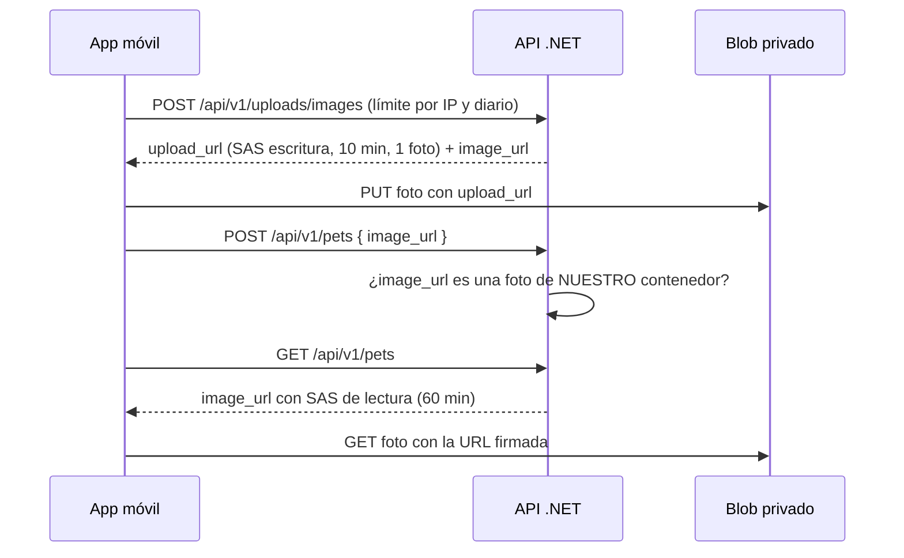

# Azure Blob Storage, seguridad y variables de entorno

Las fotos de las mascotas se guardan en un contenedor **privado** de Azure Blob Storage. Nadie puede
leer ni escribir fotos sin una **URL firmada (SAS)** temporal que emite la API, y la llave de Azure
solo existe en `backend/.env` (nunca en git ni en la app).



## 1. Protección contra abuso

| Riesgo | Protección |
|---|---|
| Robo de la llave de Azure | Solo vive en `backend/.env` (en `.gitignore`); la app nunca la recibe |
| Alguien sube miles de archivos | Máx. **5 URLs de subida por minuto por IP** y **tope global de 200 fotos al día** (429) |
| Spam de publicaciones | Máx. **20 publicaciones por minuto por IP** (429) |
| Subir cualquier archivo con una URL filtrada | Cada SAS sirve para **un solo blob**, con nombre aleatorio elegido por la API, solo permisos Create/Write y vence en 10 min |
| Publicar enlaces a imágenes externas | `POST /api/v1/pets` solo acepta `image_url` de **nuestro** contenedor |
| Usar tu Storage como hosting gratis (hotlinking) | Contenedor **privado**; las URLs de lectura caducan en 60 min |
| Tráfico sin cifrar | Solo HTTPS, TLS 1.2 mínimo |

Los límites se ajustan con variables `RateLimits__*` (ver sección 4). Se guardan en memoria: se
reinician si reinicias la API, lo cual es suficiente para un proyecto escolar.

> Una SAS no puede limitar el tamaño del archivo. La app comprime la foto (`quality: 0.7`) y el tope
> diario limita cuántas se pueden subir.

## 2. Qué debe tener la cuenta de Azure

Definido en [`infra/storage.bicep`](../infra/storage.bicep):

| Recurso | Configuración |
|---|---|
| Cuenta de almacenamiento | StorageV2, **Standard_LRS** (la más barata), nivel Hot |
| | Solo HTTPS, TLS 1.2 mínimo |
| | Acceso anónimo a blobs: **deshabilitado** |
| | Acceso con llave de cuenta: **habilitado** (la API firma las SAS con ella) |
| Servicio de blobs | CORS `GET, PUT, OPTIONS` solo desde los orígenes indicados (solo lo usa Expo Web) · papelera de 7 días |
| Contenedor (`pet-images` o el tuyo) | Nivel de acceso: **Privado** |

Si ya tienes una cuenta (por ejemplo, `up23`), solo necesitas que cumpla lo anterior; la API crea el
contenedor privado si no existe.

## 3. Crear el Storage

### Opción A: script

```powershell
winget install -e --id Microsoft.AzureCLI
```

Cierra y abre la terminal, luego:

```powershell
az login
./infra/deploy-storage.ps1
```

Crea el grupo de recursos, despliega `storage.bicep` y escribe `AzureBlob__ConnectionString` y
`AzureBlob__ContainerName` en `backend/.env` **sin mostrar la llave**. Si Azure responde
`RequestDisallowedByPolicy` (típico en Azure for Students), usa otra región: `-Location eastus`.

### Opción B: portal de Azure

1. **Crear un recurso → Cuenta de almacenamiento**. Rendimiento **Estándar**, redundancia **LRS**.
2. En **Opciones avanzadas**: transferencia segura **Sí**, TLS mínimo **1.2**, acceso anónimo a blobs
   **No**, acceso con clave de cuenta **Sí**.
3. **Contenedores → + Contenedor** con nivel de acceso **Privado**.
4. **Claves de acceso → Mostrar → Cadena de conexión** y pégala en `backend/.env`:

   ```
   AzureBlob__ConnectionString=DefaultEndpointsProtocol=https;AccountName=...;AccountKey=...;EndpointSuffix=core.windows.net
   AzureBlob__ContainerName=<tu-contenedor>
   ```

### CORS para la versión web

Si la app en el navegador muestra "No se pudo subir la foto", la cuenta no tiene CORS (Azure responde
`CorsPreflightFailure`). La app en el celular no lo necesita. Con la cadena de conexión en `backend/.env`:

```powershell
dotnet run infra/configure-cors.cs
```

Por defecto permite `http://localhost:8081`; para otros orígenes pásalos como argumentos. Azure tarda unos
segundos en aplicarlo. Ya está configurado en la cuenta `up23`.

### Verificar

```powershell
dotnet run --project backend/src/RegresaACasa.Api --launch-profile http
```

En otra terminal:

```powershell
Invoke-RestMethod -Method Post http://localhost:5105/api/v1/uploads/images -ContentType 'application/json' -Body '{"content_type":"image/jpeg"}'
```

Debe devolver `upload_url`, `image_url` y `expires_at`. Si abres `image_url` directo en el navegador,
Azure debe **rechazarla** (es privada); en el muro (`GET /api/v1/pets`) aparece con firma y sí se ve.

### Si la llave se filtra

**Portal → Cuenta de almacenamiento → Claves de acceso → Rotar clave** y actualiza `backend/.env`.
Las SAS firmadas con la llave vieja dejan de funcionar al instante.

## 4. Restricciones del .env

| Archivo real (ignorado por git) | Plantilla | Lo lee |
|---|---|---|
| `backend/.env` | [`backend/.env.example`](../backend/.env.example) | La API al arrancar ([`DotEnvFile`](../backend/src/RegresaACasa.Api/Configuration/DotEnvFile.cs)) |
| `mobile/.env.local` | [`mobile/.env.example`](../mobile/.env.example) | Expo al empaquetar la app ([`env.ts`](../mobile/src/config/env.ts)) |

Las variables del sistema tienen prioridad sobre `backend/.env`.

### Backend

La API valida todo **al arrancar**. Si algo es inválido, no inicia y dice qué variable está mal.

| Variable | Development | Otros entornos | Reglas |
|---|---|---|---|
| `ConnectionStrings__Default` | Opcional (vacía = BD en memoria) | **Obligatoria** | PostgreSQL |
| `AzureBlob__ConnectionString` | Opcional (vacía = subida responde 503) | **Obligatoria** | Con `AccountName` y `AccountKey`; fuera de Development: `https` y sin Azurite |
| `AzureBlob__ContainerName` | `pet-images` | | 3-63 caracteres: minúsculas, números, guiones; sin `--` ni guion al inicio o final |
| `AzureBlob__SasExpiryMinutes` | `10` | | 1-60 (URL de subida) |
| `AzureBlob__ReadSasMinutes` | `60` | | 5-1440 (URLs de lectura del muro) |
| `RateLimits__UploadsPerMinutePerIp` | `5` | | 1-1000 |
| `RateLimits__UploadsPerDay` | `200` | | 1-100000 (tope global) |
| `RateLimits__WritesPerMinutePerIp` | `20` | | 1-1000 |

Las pruebas (`dotnet test`) ignoran `backend/.env`: siempre usan BD en memoria y nunca tocan Azure.

### App móvil

| Variable | Requerida | Reglas |
|---|---|---|
| `EXPO_PUBLIC_API_URL` | **Sí** | URL `http(s)://` sin query; en builds de producción solo `https` |
| `EXPO_PUBLIC_SKIP_IMAGE_UPLOAD` | No | `true`/`false`; `true` solo en desarrollo |

Todo lo que empieza con `EXPO_PUBLIC_` queda dentro de la app y es público: **nunca** pongas ahí la
llave de Azure ni contraseñas.

### Reglas para el equipo

- Nunca subas `backend/.env` ni `mobile/.env.local`. Antes de cada commit, `git status` no debe mostrarlos.
- No pegues la llave en capturas, chats o issues. Si pasa, rótala.
- Cada integrante tiene su propio `.env`; se comparten las plantillas `.env.example`, no los valores.
