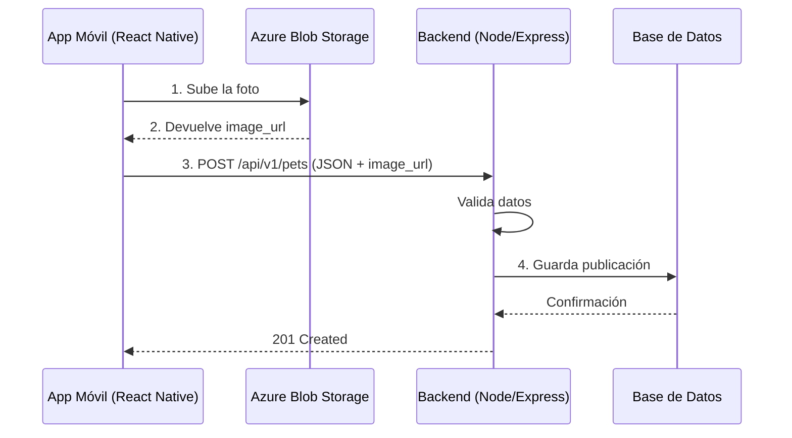
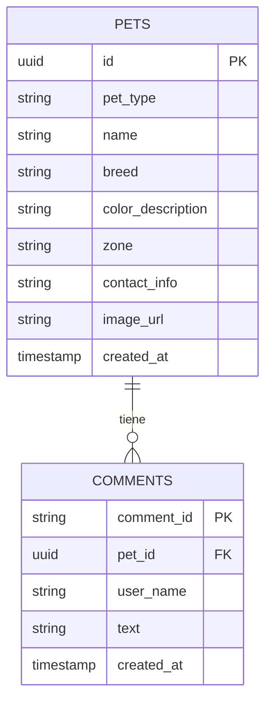

# Mockups y Diseño de Backend
## Red Social de Mascotas Perdidas (MVP Simplificado)

---

## 1. Diagrama de Arquitectura y Flujo de Datos

**Componentes:**
- Aplicación Móvil (React Native) — Muro, Cuestionario, Comentarios
- Servidor Backend (Node.js / Express.js) — recibe peticiones HTTP, valida datos, procesa la lógica
- Base de Datos (PostgreSQL o MongoDB) — almacena publicaciones y comentarios
- Azure Blob Storage — receptor exclusivo de las fotografías estáticas

**Flujo:**



---

## 2. Modelo de Base de Datos (Esquema ER)

Sin roles separados de usuario: todos comparten los mismos permisos.



---

## 3. Contrato de API (Documentación JSON)

### `GET /api/v1/pets`
Devuelve la lista de todas las publicaciones recientes.

**Response 200:**
```json
[
  {
    "id": "123",
    "pet_type": "Perro",
    "name": "Max",
    "breed": "Labrador",
    "color_description": "Miel con mancha blanca",
    "zone": "Centro",
    "contact_info": "4491234567",
    "image_url": "https://storage.azure.com/foto.jpg",
    "comments": [
      { "user_name": "Ana", "text": "Lo vi cerca del parque", "created_at": "2026-09-22T02:00:00Z" }
    ]
  }
]
```

### `POST /api/v1/pets`
Recibe el cuestionario de un nuevo reporte (la foto ya fue subida a Azure previamente).

**Request:**
```json
{
  "pet_type": "Perro",
  "name": "Max",
  "breed": "Labrador",
  "color_description": "Miel con mancha blanca",
  "zone": "Centro",
  "contact_info": "4491234567",
  "image_url": "https://storage.azure.com/foto.jpg"
}
```

**Response 201:**
```json
{
  "id": "123",
  "pet_type": "Perro",
  "name": "Max",
  "breed": "Labrador",
  "color_description": "Miel con mancha blanca",
  "zone": "Centro",
  "contact_info": "4491234567",
  "image_url": "https://storage.azure.com/foto.jpg",
  "comments": []
}
```

**Response 400:**
```json
{ "success": false, "message": "El campo 'zone' es requerido" }
```

### `POST /api/v1/pets/:id/comments`
Agrega un comentario a una publicación específica.

**Request:**
```json
{ "user_name": "Ana", "text": "Lo vi cerca del parque" }
```

**Response 201:**
```json
{ "user_name": "Ana", "text": "Lo vi cerca del parque", "created_at": "2026-09-22T02:00:00Z" }
```

**Response 404:**
```json
{ "success": false, "message": "No existe una publicación con ese id" }
```

---

## 4. Mock API (Servidor Falso Funcional)

Archivo `db.json` (entregado por separado) usado con `json-server`:

```
npx json-server --watch db.json --port 3000
```

URL a entregar al equipo de Frontend: `http://localhost:3000/pets`

---

## 5. Historial de cambios respecto a versiones previas

| Elemento | Versión inicial | Versión simplificada | Versión final (esta guía) |
|---|---|---|---|
| Endpoint de estado (`PUT /status`) | Sí | Eliminado | Eliminado |
| `location` | Coordenadas + referencia | `zone` simple | `zone` simple |
| `contact_info` | Objeto `{phone, whatsapp}` | Objeto `{phone, whatsapp}` | **String simple** |
| Subida de foto | URL ya subida | multipart junto con datos | **Revertido**: foto sube primero a Azure, luego JSON con `image_url` |
| Comentarios | Con `id` e `image_proof_url` | Sin `id` ni foto | Sin `id` expuesto (existe `comment_id` en BD) |
| Roles de usuario | No especificado | Un solo tipo de usuario | Un solo tipo de usuario |
| Base de datos | No especificada | No especificada | PostgreSQL o MongoDB |
