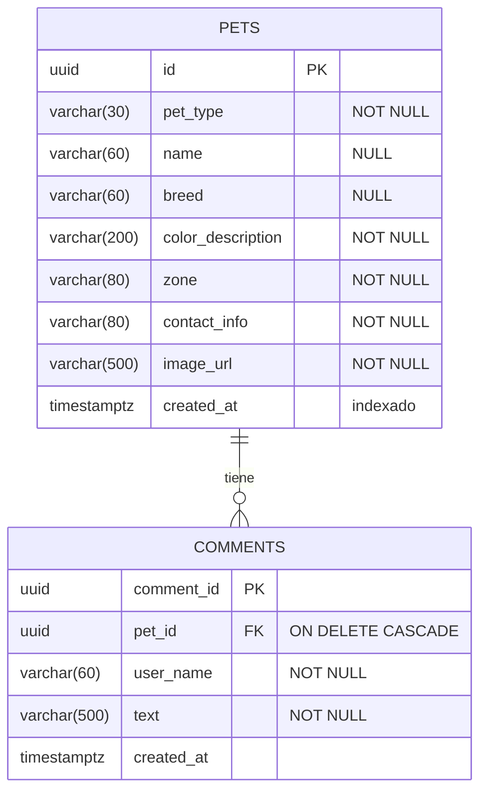

# Modelo de datos

PostgreSQL, gestionado con migraciones de EF Core
([`backend/src/RegresaACasa.Api/Data/Migrations`](../backend/src/RegresaACasa.Api/Data/Migrations)).
Sin roles de usuario: todos comparten los mismos permisos.



Notas:
- `comment_id` existe en la BD pero **no** se expone en la API (según el diseño).
- Índice en `pets.created_at` para ordenar el muro.
- Las fotos no se guardan en la BD; solo su `image_url` en Azure Blob Storage.

## Comandos de migraciones

Desde `backend/`:

```bash
dotnet tool restore
dotnet ef migrations add NombreDelCambio -p src/RegresaACasa.Api -o Data/Migrations
```

La API aplica las migraciones pendientes al arrancar cuando usa PostgreSQL.
